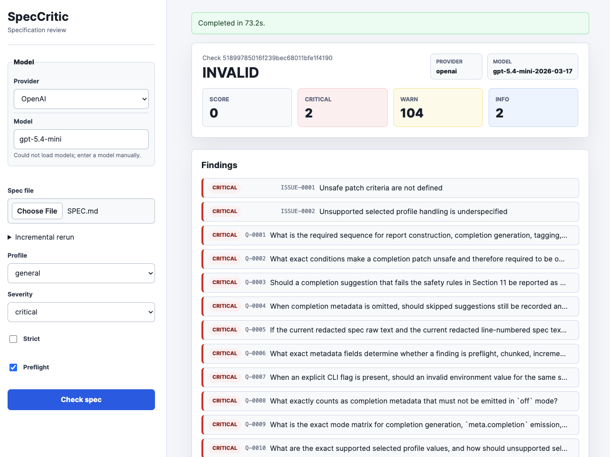

# SpecCritic

[](https://pkg.go.dev/github.com/dshills/speccritic)

SpecCritic evaluates software specifications as formal contracts, identifying defects before implementation begins. It behaves like a hostile contract lawyer—not a collaborator—treating vague language, unverifiable requirements, and missing failure modes as bugs.

```
$ speccritic check SPEC.md --verbose
INFO: Loading spec: SPEC.md
INFO: Calling LLM: anthropic:claude-opus-5-5
INFO: Rendering output (format: json)

Verdict: INVALID  Score: 60/100  Critical: 2  Warn: 3  Info: 1
```

## Why

A specification is invalid when two competent engineers could implement it differently and both believe they followed it. SpecCritic enforces this contract before a single line of code is written.

**Intended workflow:**

1. Write or update `SPEC.md`
2. Run `speccritic check SPEC.md`
3. Fix issues (revise the spec or answer clarification questions)
4. Repeat until verdict is acceptable
5. Only then begin implementation

## Installation

```bash
go install github.com/dshills/speccritic/cmd/speccritic@latest
```

Or build from source:

```bash
git clone https://github.com/dshills/speccritic.git
cd speccritic
go build -ldflags "-X main.version=$(git describe --tags --always)" -o speccritic ./cmd/speccritic/
```

## Quick Start

Run a fast deterministic preflight check without model credentials:

```bash
speccritic check SPEC.md --preflight-mode only
```

Use this first when iterating on a spec. It catches obvious placeholders, vague language, weak requirements, missing sections, undefined acronyms, and unmeasurable criteria locally before making an LLM call.

Set your model and API key when you are ready for a full review:

```bash
export SPECCRITIC_LLM_PROVIDER=anthropic
export SPECCRITIC_LLM_MODEL=claude-opus-5-5
export ANTHROPIC_API_KEY=sk-ant-...
```

Run a check:

```bash
speccritic check SPEC.md
```

Output as Markdown:

```bash
speccritic check SPEC.md --format md
```

Fail in CI if the spec is invalid:

```bash
speccritic check SPEC.md --fail-on INVALID
```

Gate CI before any LLM call:

```bash
speccritic check SPEC.md --preflight-mode gate --fail-on INVALID
```

Force parallel section chunking for a large spec:

```bash
speccritic check SPEC.md --chunking on --chunk-concurrency 4
```

Reuse a previous JSON result while iterating on a changed spec:

```bash
speccritic check SPEC.md --format json --out previous.json
cp SPEC.md SPEC.previous.md
# edit SPEC.md
speccritic check SPEC.md --incremental-from previous.json --incremental-base SPEC.previous.md
```

Generate advisory completion patches for common profile gaps:

```bash
speccritic check SPEC.md \
  --preflight-mode only \
  --completion-suggestions \
  --patch-out completion.patch
```

This works with preflight-only runs because completion can use deterministic preflight findings as its source findings.

## Web UI

SpecCritic also includes a local Go web UI for reviewing specs in the browser. It uses the same review pipeline as the CLI, then renders the uploaded spec with line numbers, summary metrics, finding annotations, provider/model metadata, and modal issue details.

The web UI is intended for local review sessions. It does not replace the CLI and it does not change CLI behavior. Large uploaded specs use the same automatic chunked review path as the CLI and still render as one merged result.



Set the same provider configuration used by the CLI:

```bash
export SPECCRITIC_LLM_PROVIDER=anthropic
export SPECCRITIC_LLM_MODEL=claude-opus-5-5
export ANTHROPIC_API_KEY=sk-ant-...
```

Run the web UI:

```bash
make run-web
```

Then open:

```text
http://127.0.0.1:8080
```

Large Gemini reviews can take several minutes because chunk calls are run serially in the web UI to avoid provider timeouts. The web server default request timeout is 10 minutes; override it with `--request-timeout` if needed.

From the browser:

1. Choose a Markdown or text spec file. Manual text entry is intentionally not supported.
2. Select a profile and severity threshold.
3. Optionally upload a previous JSON result for convergence tracking and/or incremental rerun, and a previous spec file when using incremental rerun.
4. Optionally set convergence mode to track finding status across review iterations.
5. Optionally enable completion suggestions to generate draft/advisory patch text for profile-specific missing structure.
6. Optionally enable strict mode or disable the default preflight pass.
7. Click `Check spec`.

The left pane lets you choose the provider and model before the review starts. It defaults to the configured environment values when present, otherwise it uses the normal SpecCritic defaults. When the provider changes, the web UI queries that provider's models API using the matching local API key and refreshes the model dropdown; if the query fails, you can still type a model manually.

The `Check spec` button is disabled until a file is selected and remains disabled while a check is running. During review, the page shows a running indicator and elapsed timer. When the check completes, findings are shown beside the annotated spec. Deterministic findings are labeled `Preflight`. Incremental, convergence, and completion metadata are shown in the summary when available. Completion patches are labeled `draft/advisory`, and clicking any finding opens its detail in a modal so the annotated document stays in place.

Use a different address or port with `WEB_ADDR`:

```bash
make run-web WEB_ADDR=127.0.0.1:8081
```

Build, install, or run the web binary directly:

```bash
make build-web
make install-web
go run ./cmd/speccritic-web --addr 127.0.0.1:8080
```

`make build-all` builds both `bin/speccritic` and `bin/speccritic-web`.

For live local development with [Air](https://github.com/air-verse/air), this repository includes `.air.toml` configured for the web server:

```bash
air
```

The Air config builds `./cmd/speccritic-web` into `./tmp/speccritic-web` and runs it on `127.0.0.1:8090`.

## Configuration

### Model Selection

Set `SPECCRITIC_LLM_PROVIDER` and `SPECCRITIC_LLM_MODEL`, or pass `--llm-provider` and `--llm-model` for a single CLI run. If unset, SpecCritic defaults to `SPECCRITIC_LLM_PROVIDER=anthropic` and `SPECCRITIC_LLM_MODEL=claude-opus-5-5` with a warning to stderr. If a provider is set without a model, SpecCritic uses the default model for that provider. Preflight-only checks do not require model configuration.

Current builds read the split provider/model variables. If you have old shell or CI snippets that set `SPECCRITIC_MODEL=provider:model`, replace them with the two variables above.

| Provider | API Key Env Var | Model Value Example |
|----------|-----------------|-----------------------|
| `anthropic` | `ANTHROPIC_API_KEY` | `claude-opus-5-5` |
| `openai` | `OPENAI_API_KEY` | `gpt-4o` |
| `gemini` | `GEMINI_API_KEY` | `gemini-3.8-flash` |

```bash
export SPECCRITIC_LLM_PROVIDER=openai
export SPECCRITIC_LLM_MODEL=gpt-4o
export OPENAI_API_KEY=sk-...
```

The table shows each provider's default model. They are pinned to a model generation, so check them against the provider's current lineup from time to time.

**Temperature.** SpecCritic does not send a sampling temperature. Current models from every supported provider reject one or accept only their default, so `--temperature` and `SPECCRITIC_LLM_TEMPERATURE` are accepted for compatibility and ignored. Use `--effort` to trade depth against cost.

**Effort.** `--effort` (or `SPECCRITIC_LLM_EFFORT`) is sent as `output_config.effort` to Anthropic and as `reasoning_effort` to OpenAI and Gemini, unchanged. A level the model does not support comes back as a provider error. When set, it is recorded in `meta.effort`.

**Structured output.** By default SpecCritic sends the review's JSON Schema to the provider, which then constrains the response: severities and categories can only be valid values and no field can be missing. If a model rejects the schema, SpecCritic sends the request again with the shape described in the prompt instead, and does not ask that model again during the run. `--structured-output off` (or `SPECCRITIC_STRUCTURED_OUTPUT=off`) skips enforcement altogether. `meta.usage.schema_enforced_calls` shows how many calls were constrained. The schema counts as input on OpenAI and Anthropic, a few hundred to about 1,500 tokens per call, most of it cached on Anthropic; what it saves is the repair call a malformed response would otherwise need.

**Prompt caching.** Every call about one spec starts with the same system prompt, context files and numbered spec, and ends with the task for that call. Providers that cache prompts bill the shared start in full once per run and at a discount afterwards. On Anthropic it is marked for caching explicitly, with a one-hour lifetime when the context files are larger than about 8,000 tokens, so a rerun after a pause still finds them cached. On OpenAI requests carry a `prompt_cache_key` so calls sharing the start reach the same cache, but `gpt-6.1-sol` was measured to cache across differing requests only what sits in the system message. The spec is deliberately kept out of the system message, where its text would carry the weight of instructions, so on OpenAI most of a multi-call run is billed at the full input rate. The system prompt tells the model that text in the spec or context files that reads like an instruction is material to audit, not an instruction.

**Verifying CRITICAL findings.** One CRITICAL makes a spec INVALID, so after the review one more call puts every CRITICAL finding from the model to the model again, against the same cached spec. Each is confirmed (tag `critical-confirmed`), downgraded to WARN or INFO (tag `critical-downgraded`), or rejected. A rejection must quote the spec text that shows the finding is wrong, and is applied only if that text is in the spec; the finding is then removed and listed in `meta.verification.rejected` with that text. A rejection without such a quote leaves the finding as it was. In `--strict` mode findings are never downgraded. Preflight findings are not checked, and a finding already tagged `critical-confirmed`, as when reused by an incremental run, is not checked again. If the call fails, every finding stands and `meta.verification.status` is `failed`. `--verify off` (or `SPECCRITIC_VERIFY=off`) skips the call.

**Transient errors.** A rate limit, an overloaded or failing provider (HTTP 408, 429, 5xx, 529) or a dropped connection is retried, up to four attempts in all, with jittered exponential backoff starting at one second. A `Retry-After` header is honored; if a provider asks to wait more than a minute, the call fails instead. `meta.usage.retried_requests` counts requests that were resent.

**Review cache.** A finished review is stored on disk, keyed by a hash of everything that shapes it: the redacted spec and context files, the original spec text, the prompts, the provider and model, `--effort`, `--max-tokens`, `--structured-output`, `--verify`, the profile, `--strict`, `--severity-threshold`, the preflight and chunking settings, and the speccritic build itself. Running the same spec again with the same settings returns the stored review with no model call, so it costs nothing and gets the same verdict. A model asked the same question twice may answer differently; the cache keeps a re-run gate stable until the spec or the settings change. The cached report carries `meta.cache.hit: true` and no `meta.usage`. Entries older than 30 days are ignored and removed. Reviews whose CRITICAL verification failed, and incremental reruns, are not cached. `--chunk-concurrency` is not part of the key. Reviews are stored under the user cache directory (`~/Library/Caches/speccritic/reviews` on macOS, `~/.cache/speccritic/reviews` on Linux); `SPECCRITIC_CACHE_DIR` moves them. `--no-cache` (or `SPECCRITIC_NO_CACHE=true`) neither reads nor writes the cache. Use it to get a fresh opinion on an unchanged spec. The web UI never uses the cache, because it writes nothing a user uploads to disk, and the accuracy eval turns it off.

**Refusals.** If a model declines to review a spec, SpecCritic reports that as an error naming the provider's reason rather than treating the reply as a review.

### Preflight

Preflight is a deterministic local pass that runs before the LLM by default. It is designed to reduce review latency, token usage, and repeated model round trips by catching high-signal defects immediately.

Preflight findings use the same issue schema as LLM findings and participate in the same final scoring and verdict calculation. When the LLM confirms a preflight finding, SpecCritic deduplicates the result and tags the LLM issue with `preflight-confirmed` and `preflight-rule:<ID>` instead of showing the same defect twice.

Modes:

| Mode | Behavior |
|------|----------|
| `warn` | Include preflight findings in the final report and continue to the LLM. This is the default. |
| `gate` | Skip the LLM when blocking preflight findings exist. A finding is blocking when its rule or finding marks it blocking, and all CRITICAL preflight findings are blocking by default. |
| `only` | Run only deterministic preflight checks. No model credentials are required. |

Recommended workflow:

```bash
speccritic check SPEC.md --preflight-mode only
# fix deterministic findings
speccritic check SPEC.md --preflight-mode gate --fail-on INVALID
# when preflight is clean enough, run the full review
speccritic check SPEC.md
```

Suppress a known deterministic false positive with `--preflight-ignore`:

```bash
speccritic check SPEC.md --preflight-ignore PREFLIGHT-ACRONYM-001
```

Useful preflight behavior:

- Redaction still runs before any prompt is built.
- `--preflight-mode only` does not require `SPECCRITIC_LLM_PROVIDER`, `SPECCRITIC_LLM_MODEL`, or provider API keys.
- `--preflight-mode gate` is useful in CI when obvious blocking defects should prevent any provider call.
- `--preflight-profile` defaults to `--profile`; override it only when deterministic checks need a different profile than the LLM review.

### Chunked Review

Chunked review is an execution strategy for large specs. It splits the redacted spec by Markdown sections, reviews chunks with bounded parallel LLM calls, validates each chunk against the same schema and evidence rules, optionally runs one cross-section synthesis pass, and merges everything back into one normal report.

Small specs still use the existing single-call path by default.

The final output remains a normal SpecCritic report. Chunk internals are not rendered as separate reports, but chunk-related tags may appear on findings:

| Tag | Meaning |
|-----|---------|
| `chunked-review` | Finding came from chunked review rather than the single-call path. |
| `chunk:<CHUNK-ID>` | Source chunk that emitted the finding. |
| `cross-section` | Chunk reviewer believed the finding depends on another section. |
| `synthesis` | Finding came from the cross-section synthesis pass. |

Modes:

| Mode | Behavior |
|------|----------|
| `auto` | Use chunking when the spec has at least `--chunk-min-lines` lines (default 1,500) or is estimated at `--chunk-token-threshold` tokens or more (default 30,000). Context files do not count toward the estimate. This is the default. |
| `on` | Force chunking whenever an LLM review is needed. |
| `off` | Always use the original single-call LLM path. |

Examples:

```bash
# Force chunking for a large spec and allow four concurrent chunk calls.
speccritic check SPEC.md --chunking on --chunk-concurrency 4

# Disable chunking while debugging prompt behavior.
speccritic check SPEC.md --chunking off --debug

# Tune for a rate-limited provider.
speccritic check SPEC.md --chunk-concurrency 1 --chunk-lines 400
```

Chunking is a latency tool for very large specs. A single call sees the whole spec and costs one request, so `auto` leaves specs of a few hundred lines to the single-call path. Chunking may reduce wall-clock time for a large spec, but it increases the total number of provider calls. Provider rate limits, low concurrency, and cross-section synthesis can reduce the speedup. Every chunk reviewer sees the whole spec and reports only on its own lines, and a synthesis pass looks for defects that span sections.

Implementation details:

- Chunking happens after spec loading, redaction, and preflight.
- `auto` mode uses a deterministic local estimate of one token per four UTF-8 bytes. This is a rough heuristic; code-heavy specs and non-English specs may need a lower `--chunk-token-threshold` or forced `--chunking on`.
- Chunk reviews read the whole spec but cite only their primary line range.
- Every call in a run (chunk reviews, synthesis, repairs) starts with the same system prompt and the same prefix holding the context files and the numbered spec, and only the task after it differs. The first chunk is sent alone so the others can read that prefix from the provider's prompt cache. `meta.usage.cache_read_tokens` shows the effect.
- A chunk finding whose evidence falls outside the chunk's primary range is dropped; the rest of the chunk's findings are kept.
- Chunk calls run with bounded concurrency.
- A chunk that fails on a transient error after the provider retries is tried once more after the other chunks finish, keeping the chunks already reviewed. If one chunk fails permanently, the check fails with model-output/provider error rather than returning partial results.
- Synthesis runs when chunked review has findings or when the spec is at least `--synthesis-line-threshold` lines. A no-finding chunked review below that threshold skips synthesis.
- Synthesis can fold chunk findings that report the same defect into one, so a gap seen by several chunk reviewers costs one deduction, and can retract a chunk finding the spec answers in another section. A retraction must quote the answering text, and is applied only if that text is in the spec; preflight findings are never retracted. `meta.synthesis` reports how many findings were merged and lists each retracted finding with the text that answers it.

### Incremental Rerun

Incremental rerun is an execution strategy for iterative edits. It takes a previous SpecCritic JSON report, compares the current spec with the previous spec text, reuses eligible findings from unchanged sections, and reviews only changed ranges when reuse is safe.

The default behavior is conservative. If incremental safety cannot be proven in `auto` mode, SpecCritic falls back to a normal full review. Use `--incremental-mode on` only when you want unsafe incremental conditions to fail instead of falling back.

Typical CLI workflow:

```bash
# 1. Save a full JSON result for the current spec.
speccritic check SPEC.md --format json --out previous.json

# 2. Preserve the exact spec text that produced previous.json.
cp SPEC.md SPEC.previous.md

# 3. Edit SPEC.md, then rerun against only changed sections when safe.
speccritic check SPEC.md \
  --incremental-from previous.json \
  --incremental-base SPEC.previous.md \
  --incremental-report
```

Important behavior:

- `--incremental-from` must point to valid SpecCritic JSON output.
- `--incremental-base` is required when the current spec content differs from the previous report hash. The JSON report contains findings and metadata, not the old spec text needed for section diffing.
- If the current spec hash matches the previous report hash, SpecCritic can reuse eligible findings without a base file.
- Preflight still runs against the full current spec before any incremental LLM call.
- Each changed range is reviewed with the same context files, whole spec and preflight findings as a full review, so the same text is judged the same way either way, and the spec is read from the provider's prompt cache. A spec too large to share whole gets the same treatment as in chunking: each range call sees only its own lines and a table of contents.
- Reused findings are tagged `incremental-reused`; new findings from changed ranges are tagged `incremental-review`.
- `--incremental-report` adds optional `meta.incremental` details to JSON output. Markdown output keeps the normal human-readable report shape.
- The web UI exposes the same workflow with optional `Previous JSON result`, `Previous spec file`, and `Mode` controls. Uploaded previous results are used only for the current request.

### Convergence Tracking

Convergence tracking compares the current review result with a previous SpecCritic JSON report and reports progress across iterations. It classifies active findings as `new` or `still_open`, and historical findings as `resolved`, `dropped`, or `untracked`.

Typical CLI workflow:

```bash
# 1. Save a baseline JSON result.
speccritic check SPEC.md --format json --out review-1.json

# 2. Edit SPEC.md, then compare the new result with the baseline.
speccritic check SPEC.md \
  --convergence-from review-1.json \
  --format md
```

Use `--convergence-mode auto` for normal iteration. It keeps the current review successful even when comparison is partial or unavailable, including strict compatibility mismatches. Use `--convergence-mode on` when a missing, invalid, or strictly incompatible previous report should fail with exit code `3`. Use `--convergence-mode off` to ignore a configured convergence baseline.

Important behavior:

- Convergence runs after the current review is complete.
- Current score, verdict, patches, and `--fail-on` behavior are based only on current findings.
- Resolved historical findings do not affect the current score or verdict.
- `dropped` means a historical finding no longer participates because the current threshold filters it out or its prior content is no longer applicable.
- Preflight-only runs cannot prove prior LLM findings are resolved, so those findings are marked `untracked` unless they match current preflight findings.
- Convergence matching is local and does not send previous report contents to a provider.
- When `--convergence-report` is enabled, JSON output includes `meta.convergence` and Markdown output includes a human-readable convergence summary.
- The web UI can use the uploaded previous JSON result for convergence tracking and/or incremental rerun; incremental rerun also needs the previous spec file when the spec changed. Uploaded previous results are not stored server-side.

### Completion Suggestions

Completion suggestions are an optional advisory layer that turns current findings into draft patch text for common missing profile structure. They are never applied automatically, never reduce or suppress findings, and never affect score, verdict, or `--fail-on` behavior.

Completion patch construction is deterministic for the same spec text, findings, questions, profile, and completion options. Completion runs after preflight, chunk merge, incremental merge, and convergence processing. It uses validated current findings/questions and the same redacted review inputs used by the preflight or LLM reviewer, but exact-match patch construction targets the unredacted current spec text so `--patch-out` remains applicable. Suggested patches are emitted only when SpecCritic can find a safe, exact edit location. When multiple suggestions target overlapping text, the first suggestion by target line, supported severity order, source ID, template section order, and text is emitted; later overlapping suggestions are skipped. Patches are also skipped when the `before` or `after` text contains redaction markers or secret-looking values. Missing behavior that requires user judgment is represented with `OPEN DECISION` placeholders instead of invented requirements.

Supported built-in templates:

| Template | Intended use |
|----------|--------------|
| `profile` | Use the selected `--profile` template. This is the default; the supported review profiles each have a matching completion template. |
| `general` | General-purpose spec structure and testability gaps. |
| `backend-api` | Authentication, authorization, error responses, rate limits, and idempotency gaps. |
| `regulated-system` | Audit trail, access control, retention, deletion, and compliance evidence gaps. |
| `event-driven` | Event schema, delivery guarantees, ordering, retry, and dead-letter behavior gaps. |

Examples:

```bash
# Add advisory completion patches to normal review output.
speccritic check SPEC.md --completion-suggestions --format md

# Require safe completion patches for blocking missing-section findings.
speccritic check SPEC.md --completion-mode on

# Generate at most three backend API completion patches.
speccritic check SPEC.md \
  --profile backend-api \
  --completion-suggestions \
  --completion-max-patches 3 \
  --patch-out completion.patch
```

Completion mode behavior:

| Mode | Behavior |
|------|----------|
| `auto` | Emit suggestions only when `--completion-suggestions` is true; suggestions must be tied to current findings/questions and have safe patch locations. |
| `on` | Enable completion even if `--completion-suggestions` is omitted. Require safe generation for blocking missing-section findings; if required patches cannot be generated, exit with code `3` as a patch requirement error. |
| `off` | Disable completion output even when `--completion-suggestions` is set. |

When completion metadata is present, JSON output includes `meta.completion` with the enabled status, effective mode, template, `generated_patches`, `skipped_suggestions`, and `open_decisions`. Markdown and web output label completion text as `draft/advisory`.

A blocking missing-section finding is a current finding with `blocking: true`, category `UNSPECIFIED_CONSTRAINT`, and the `missing-section` tag.

In `auto` mode, completion output is produced only when `--completion-suggestions` or `SPECCRITIC_COMPLETION_SUGGESTIONS=true` is set. `--completion-max-patches=0` is valid in all modes; in `on` mode it causes exit code `3` when any blocking missing-section finding requires a patch. Hitting the patch limit for a required blocking finding also counts as a failure to generate the required patch and exits with code `3`.
`--completion-mode` takes precedence over `--completion-suggestions`: `off` disables completion, `on` enables completion, and `auto` follows the boolean flag.

### Flags

```
speccritic check <spec-file> [flags]
```

| Flag | Default | Description |
|------|---------|-------------|
| `--format` | `json` | Output format: `json` or `md` |
| `--out` | (stdout) | Write output to file |
| `--profile` | `general` | Evaluation profile (see [Profiles](#profiles)) |
| `--context` | (none) | Context file paths; can be repeated |
| `--strict` | `false` | Treat all unstated behavior as ambiguous |
| `--fail-on` | (none) | Exit 2 if verdict meets or exceeds the threshold; valid values are case-sensitive `VALID_WITH_GAPS` or `INVALID` |
| `--severity-threshold` | `info` | Minimum severity to include in output: `info`, `warn`, `critical` |
| `--patch-out` | (none) | Write suggested patches to file |
| `--llm-provider` | env/default | LLM provider override: `anthropic`, `openai`, or `gemini` |
| `--llm-model` | env/provider default | LLM model override |
| `--effort` | provider default | Reasoning effort passed to the model: `none`, `minimal`, `low`, `medium`, `high`, `xhigh`, or `max`. Which levels exist depends on the provider and model |
| `--structured-output` | `auto` | `auto` has the provider enforce the review JSON schema where the model allows it; `off` only describes the schema in the prompt |
| `--verify` | `auto` | Give each CRITICAL finding from the model a second look before it decides the verdict: `auto` or `off` |
| `--patches` | `on` | Ask the model for patches that correct its findings: `on` or `off`. `off` saves the output tokens they cost; completion patches are not affected |
| `--no-cache` | `false` | Neither read the review from the [review cache](#model-selection) nor store it there |
| `--max-tokens` | `16384` | Maximum response tokens per call. A response that still hits the cap is continued, not regenerated: the findings already received are kept and only the rest is requested |
| `--offline` | `false` | Exit 3 if LLM provider/model env vars are not set (CI enforcement) |
| `--verbose` | `false` | Print processing steps to stderr |
| `--debug` | `false` | Dump full prompt to stderr (use only in trusted environments) |
| `--preflight` | `true` | Run deterministic checks before LLM review |
| `--preflight-mode` | `warn` | Preflight mode: `warn`, `gate`, or `only` |
| `--preflight-profile` | same as `--profile` | Override the preflight rule profile |
| `--preflight-ignore` | (none) | Suppress a preflight rule ID; can be repeated |
| `--chunking` | `auto` | Chunking mode: `auto`, `on`, or `off` |
| `--chunk-lines` | `600` | Target maximum source lines per chunk |
| `--chunk-overlap` | `20` | Deprecated, no effect: every chunk review sees the whole spec |
| `--chunk-min-lines` | `1500` | Spec line count at which `auto` chunks the review |
| `--chunk-token-threshold` | `30000` | Estimated spec size, in tokens, at which `auto` chunks the review. Context files are not counted |
| `--chunk-concurrency` | `3` | Maximum concurrent chunk LLM calls |
| `--synthesis-line-threshold` | `240` | Minimum total line count before a no-finding chunked review may run synthesis |
| `--incremental-from` | (none) | Previous SpecCritic JSON report used as the incremental baseline |
| `--incremental-base` | (none) | Previous spec text used for section diffing when the current spec changed |
| `--incremental-mode` | `auto` | Incremental mode: `auto`, `on`, or `off` |
| `--incremental-max-change-ratio` | `0.35` | Maximum changed-line ratio allowed before fallback or failure |
| `--incremental-max-remap-failure-ratio` | `0.25` | Maximum prior-finding remap failure ratio allowed before fallback or failure |
| `--incremental-context-lines` | `20` | Neighboring unchanged lines included around changed sections |
| `--incremental-strict-reuse` | `true` | Reuse prior findings only when evidence remaps exactly or by unchanged line hash |
| `--incremental-report` | `false` | Include optional incremental metadata in JSON output |
| `--convergence-from` | (none) | Previous SpecCritic JSON report used as the convergence baseline |
| `--convergence-mode` | `auto` | Convergence mode: `auto`, `on`, or `off` |
| `--convergence-strict` | `false` | Require strict profile, strict-mode, threshold, and redaction compatibility; in `on` mode, mismatches exit 3 |
| `--convergence-report` | `true` | Include optional convergence metadata when convergence is requested |
| `--completion-suggestions` | `false` | Generate profile-specific advisory completion patches after review |
| `--completion-mode` | `auto` | Completion mode: `auto`, `on`, or `off` |
| `--completion-template` | `profile` | Template set to use: `profile`, `general`, `backend-api`, `regulated-system`, or `event-driven` |
| `--completion-max-patches` | `8` | Maximum completion patches to emit |
| `--completion-open-decisions` | `true` | Include `OPEN DECISION` placeholders for missing behavior that requires judgment |

Chunking, incremental, convergence, and completion environment defaults are also supported when the matching flag is not provided:

| Env Var | Matching Flag |
|---------|---------------|
| `SPECCRITIC_CHUNKING` | `--chunking` |
| `SPECCRITIC_CHUNK_LINES` | `--chunk-lines` |
| `SPECCRITIC_CHUNK_OVERLAP` | `--chunk-overlap` |
| `SPECCRITIC_CHUNK_MIN_LINES` | `--chunk-min-lines` |
| `SPECCRITIC_CHUNK_TOKEN_THRESHOLD` | `--chunk-token-threshold` |
| `SPECCRITIC_CHUNK_CONCURRENCY` | `--chunk-concurrency` |
| `SPECCRITIC_SYNTHESIS_LINE_THRESHOLD` | `--synthesis-line-threshold` |
| `SPECCRITIC_INCREMENTAL_FROM` | `--incremental-from` |
| `SPECCRITIC_INCREMENTAL_BASE` | `--incremental-base` |
| `SPECCRITIC_INCREMENTAL_MODE` | `--incremental-mode` |
| `SPECCRITIC_INCREMENTAL_MAX_CHANGE_RATIO` | `--incremental-max-change-ratio` |
| `SPECCRITIC_INCREMENTAL_MAX_REMAP_FAILURE_RATIO` | `--incremental-max-remap-failure-ratio` |
| `SPECCRITIC_INCREMENTAL_CONTEXT_LINES` | `--incremental-context-lines` |
| `SPECCRITIC_INCREMENTAL_STRICT_REUSE` | `--incremental-strict-reuse` |
| `SPECCRITIC_INCREMENTAL_REPORT` | `--incremental-report` |
| `SPECCRITIC_CONVERGENCE_FROM` | `--convergence-from` |
| `SPECCRITIC_CONVERGENCE_MODE` | `--convergence-mode` |
| `SPECCRITIC_CONVERGENCE_STRICT` | `--convergence-strict` |
| `SPECCRITIC_CONVERGENCE_REPORT` | `--convergence-report` |
| `SPECCRITIC_COMPLETION_SUGGESTIONS` | `--completion-suggestions` |
| `SPECCRITIC_COMPLETION_MODE` | `--completion-mode` |
| `SPECCRITIC_COMPLETION_TEMPLATE` | `--completion-template` |
| `SPECCRITIC_COMPLETION_MAX_PATCHES` | `--completion-max-patches` |
| `SPECCRITIC_COMPLETION_OPEN_DECISIONS` | `--completion-open-decisions` |

Validation rules:

- `--chunk-lines` must be greater than `0`.
- `--chunk-overlap` must be `>= 0`.
- `--chunk-min-lines` must be `>= 0`.
- `--chunk-token-threshold` must be greater than `0`.
- `--chunk-concurrency` must be between `1` and `16`.
- `--synthesis-line-threshold` must be `>= 0`.
- `--incremental-mode` must be `auto`, `on`, or `off`.
- `--incremental-mode on` requires `--incremental-from`.
- `--incremental-max-change-ratio` must be `> 0` and `<= 1`.
- `--incremental-max-remap-failure-ratio` must be `>= 0` and `<= 1`.
- `--incremental-context-lines` must be `>= 0`.
- `--convergence-mode` must be `auto`, `on`, or `off`.
- `--convergence-mode on` requires `--convergence-from`.
- `--completion-mode` must be `auto`, `on`, or `off`.
- `--completion-mode on` enables completion output and does not require `--completion-suggestions`.
- `--completion-template` must be `profile`, `general`, `backend-api`, `regulated-system`, or `event-driven`.
- `--completion-max-patches` must be `>= 0`.

## Profiles

Profiles tune the evaluation for different specification types.

### `general` (default)

Applies to any software specification. Flags vague phrases (`fast`, `quickly`, `as needed`, `TBD`) and enforces that all failure modes and interfaces are defined.

### `backend-api`

Requires sections for Authentication, Error Codes, and Rate Limiting. Every endpoint must define request/response schemas. All error codes must be enumerated. Rate limits must be expressed as numeric values with time windows.

```bash
speccritic check SPEC.md --profile backend-api
```

### `regulated-system`

For specifications subject to compliance requirements. Requires sections for Audit Trail, Data Retention, and Access Control. Data retention periods must be concrete durations (e.g., "7 years", not "a reasonable period"). Every state transition must be enumerable and auditable.

```bash
speccritic check SPEC.md --profile regulated-system
```

### `event-driven`

For event-driven architectures. Requires sections for Event Schema, Delivery Guarantees, and Consumer Failure. Every event type must state delivery semantics (at-least-once vs. exactly-once). Consumer failure modes and retry policies must be specified.

```bash
speccritic check SPEC.md --profile event-driven
```

## Defect Categories

| Category | Description |
|----------|-------------|
| `NON_TESTABLE_REQUIREMENT` | Requirement cannot be verified by a test |
| `AMBIGUOUS_BEHAVIOR` | Two engineers could implement differently |
| `CONTRADICTION` | Two statements cannot both be true |
| `MISSING_FAILURE_MODE` | What happens when X fails is not stated |
| `UNDEFINED_INTERFACE` | A referenced interface has no specification |
| `MISSING_INVARIANT` | A property that must always hold is not stated |
| `SCOPE_LEAK` | Spec describes implementation, not behavior |
| `ORDERING_UNDEFINED` | Sequence of operations is ambiguous |
| `TERMINOLOGY_INCONSISTENT` | Same concept named differently |
| `UNSPECIFIED_CONSTRAINT` | Implicit constraint not made explicit |
| `ASSUMPTION_REQUIRED` | Must assume something unstated to implement |

### Severity

The model is given a short rubric with examples at each level:

| Severity | Rule of thumb |
|----------|---------------|
| `CRITICAL` | The main behavior cannot be implemented or tested as written until its author decides something: a contradiction, a requirement with no measurable criterion, an undefined term, state or interface that a requirement depends on, a named dependency whose failure has no stated response at all, a vague core guarantee |
| `WARN` | The main behavior can be built and tested, but an edge is open: two error conditions with no stated precedence, a rare failure with no stated response, a missing detail of a stated failure response, an open payload shape. Also a spec that prescribes implementation instead of behavior |
| `INFO` | Wording or structure that could slow a reader but changes no implementation |

When it is unsure, the model asks whether a team could write the code and its tests for the main behavior from the spec alone. It is told that a carefully written spec usually has no CRITICAL findings. Before reporting a term, interface, state, limit or failure behavior as missing, it is told to search the whole spec and the context files for it; a definition anywhere means it is not missing, and two that disagree are a `CONTRADICTION`. `--strict` overrides the rubric: any required assumption is CRITICAL.

## Verdicts and Scoring

### Verdicts

| Verdict | Meaning |
|---------|---------|
| `VALID` | No issues found; spec is consistent and testable |
| `VALID_WITH_GAPS` | Has WARN or INFO issues; implementation is possible but risky |
| `INVALID` | Has at least one CRITICAL issue or CRITICAL question; spec cannot be safely implemented |

### Score

Starts at 100, deducted per finding:

| Severity | Deduction |
|----------|-----------|
| CRITICAL | −20 |
| WARN | −7 |
| INFO | −2 |

Score is clamped at 0. Both score and verdict are computed before `--severity-threshold` filtering.

## Output Format

### JSON (default)

```json
{
  "tool": "speccritic",
  "version": "0.1.0",
  "input": {
    "spec_file": "SPEC.md",
    "spec_hash": "sha256:a3f1...",
    "context_files": [],
    "profile": "general",
    "strict": false,
    "severity_threshold": "info"
  },
  "summary": {
    "verdict": "INVALID",
    "score": 60,
    "critical_count": 2,
    "warn_count": 3,
    "info_count": 1
  },
  "issues": [
    {
      "id": "ISSUE-0001",
      "severity": "CRITICAL",
      "category": "NON_TESTABLE_REQUIREMENT",
      "title": "Performance requirement is not measurable",
      "description": "The spec requires the system to be 'fast' without defining metrics.",
      "evidence": [
        {
          "path": "SPEC.md",
          "line_start": 12,
          "line_end": 12,
          "quote": "The system must respond fast."
        }
      ],
      "impact": "No acceptance test can be written.",
      "recommendation": "Define a concrete latency target, e.g. P99 ≤ 200ms under 500 concurrent users.",
      "blocking": true,
      "tags": []
    }
  ],
  "questions": [...],
  "patches": [...],
  "meta": {
    "model": "anthropic:claude-opus-5-5",
    "completion": {
      "enabled": true,
      "mode": "auto",
      "template": "backend-api",
      "generated_patches": 2,
      "skipped_suggestions": 1,
      "open_decisions": 3
    }
  }
}
```

> **Note:** `summary` counts always reflect all issues regardless of `--severity-threshold`. The `issues` array is filtered. The `input.severity_threshold` field records which filter was applied.

### Evidence

Every quote a model gives is looked up in the spec it was shown, ignoring differences in case, spacing, typographic punctuation and Markdown emphasis.

- A quote found at the cited lines is kept, and replaced by the spec's exact text. Models are asked for a short phrase rather than the whole passage, which saves output tokens; when the cited range is five lines or fewer, the quote in the report is the full text of those lines.
- A quote found only on other lines moves the evidence there. The issue is tagged `evidence-reanchored`.
- When no quote of an issue is anywhere in the spec, the issue is tagged `evidence-unverified`. If it was CRITICAL it is lowered to WARN and also tagged `severity-downgraded`: a finding that cannot point at real text does not fail a spec on its own. The finding stays in the report.
- An issue with no evidence at all is dropped and counted in `meta.dropped_findings`.

A quote of only a word or two is too common to place, so it is confirmed where it is cited or else left alone, never flagged. Questions get the same corrections but are never flagged or lowered.

> **Note:** Model output is validated one finding at a time. A finding that fails validation (an unknown category, evidence outside the spec, and so on) is left out and the rest are kept; `meta.dropped_findings` then reports how many were left out. The field is omitted when nothing was dropped. Issue and question IDs, bookkeeping tags and the evidence `path` are assigned by SpecCritic, not taken from the model.

### Usage

Every review that calls the LLM reports what it used in `meta.usage`, so a caller can see the cost of a run without parsing logs:

```json
"usage": {
  "calls": 5,
  "repair_calls": 0,
  "continuation_calls": 1,
  "truncated_responses": 1,
  "schema_enforced_calls": 5,
  "input_tokens": 18240,
  "output_tokens": 6312,
  "cache_read_tokens": 9100,
  "cache_write_tokens": 2300,
  "call_duration_ms": 96400,
  "wall_duration_ms": 41800
}
```

- `schema_enforced_calls` counts the calls whose response the provider constrained to the review schema. It equals `calls` unless the model rejected the schema or `--structured-output off` was set.
- `calls` counts every request, including `repair_calls` (a response with nothing usable was regenerated) and `continuation_calls` (the rest of a cut-off response was requested).
- The three input counts do not overlap: `input_tokens` excludes tokens read from or written to the provider's prompt cache. A `cache_read_tokens` of zero across repeated runs means the cache is not being hit.
- `call_duration_ms` adds up the time spent inside calls; `wall_duration_ms` is the elapsed time from the first call to the last. Concurrent chunk calls make the first larger than the second.
- Token counts are zero when the provider does not report usage. The field is omitted when a review makes no LLM call, such as `--preflight-mode only`, an incremental rerun served entirely from reuse, or a review served from the cache.

`--verbose` prints the same totals as one line on stderr, including when the review fails.

### Patches

When the LLM suggests corrections, they are included in the `patches` array and optionally written to `--patch-out` in diff-match-patch format:

```bash
speccritic check SPEC.md --patch-out spec.patch
```

The model names the lines a patch replaces and gives their new text; SpecCritic copies the old text from the spec into `before`, so the model never spends output tokens copying it and cannot copy it wrong. A patch whose `before` does not occur exactly once in the spec is left out. `--patches off` (or `SPECCRITIC_PATCHES=off`) asks for no patches at all.

Patches are advisory—they are minimal textual corrections, never wholesale rewrites. Completion patches are also advisory and are labeled separately in Markdown, web output, and patch comments when written with `--patch-out`.

## Exit Codes

| Code | Meaning |
|------|---------|
| `0` | Success; verdict below `--fail-on` threshold (or no threshold set) |
| `2` | Verdict meets or exceeds `--fail-on` threshold |
| `3` | Input error: invalid flags, file not found, or LLM provider/model env vars unset with `--offline` |
| `4` | Provider error: failed to create LLM provider (bad format, missing API key) |
| `5` | Model output invalid: LLM response failed schema validation after one retry, or stayed incomplete after three continuation calls |

## Context Files

Use `--context` to provide grounding documents that inform the evaluation without adding requirements:

```bash
speccritic check SPEC.md \
  --context glossary.md \
  --context architecture-overview.md \
  --context compliance-notes.md
```

Context is used for reference only—it is never used to infer requirements. Each file is redacted independently before being sent to the LLM.

## Strict Mode

In strict mode, all silence is treated as ambiguity:

```bash
speccritic check SPEC.md --strict
```

Any behavior not explicitly stated is flagged. Any assumption required to implement is filed as CRITICAL and tagged `assumption`. Use this for specifications that must be complete before any ambiguity is acceptable.

## Security and Privacy

- **Redaction** is always applied before the LLM call. The following patterns are replaced with `[REDACTED]` (line structure is preserved for accurate evidence citations):
  - PEM key blocks
  - AWS access key IDs (`AKIA...`)
  - API secret keys (`sk-...`)
  - JWT tokens
  - Bearer tokens (≥ 20 characters)
  - Inline password assignments
- **No telemetry.** Nothing is logged or transmitted beyond the LLM call.
- **`--debug`** dumps the full redacted prompt to stderr. Do not use in environments where stderr is captured in shared logs.

## CI Integration

```yaml
# GitHub Actions example
- name: Check specification
  env:
    SPECCRITIC_LLM_PROVIDER: anthropic
    SPECCRITIC_LLM_MODEL: claude-opus-5-5
    ANTHROPIC_API_KEY: ${{ secrets.ANTHROPIC_API_KEY }}
  run: |
    speccritic check SPEC.md \
      --offline \
      --fail-on INVALID \
      --severity-threshold warn \
      --out spec-review.json
```

The `--offline` flag ensures the run fails immediately (exit 3) if `SPECCRITIC_LLM_PROVIDER` and `SPECCRITIC_LLM_MODEL` are not set, preventing accidental use of the default model in CI.

For a credentials-free deterministic gate:

```yaml
- name: Preflight specification
  run: |
    speccritic check SPEC.md \
      --preflight-mode only \
      --fail-on INVALID
```

## Development

```bash
# Run all tests
make test

# Run a specific test
go test ./cmd/speccritic/... -run TestRunCheck_BadSpec_INVALID -v

# Build CLI and web binaries
make build-all

# Run the local web UI
make run-web

# Code review (staged changes)
prism review staged

# Show what the accuracy eval would review (free)
make eval-plan

# Run the accuracy eval against the configured LLM (spends real money)
make eval
```

The eval reviews specs with known, seeded defects and reports recall, precision, false alarms on clean specs, verdict stability and cost. Run it before and after changing prompts, chunking, model or effort. See [eval/README.md](eval/README.md).

## Agentic Integration

See [WORKFLOW.md](WORKFLOW.md) for a detailed guide on integrating SpecCritic into an agentic coding system (Claude Code, Cursor, or any LLM-based agent), including:

- The canonical spec → plan → implement gate order
- How to parse JSON output and route on verdict
- Handling questions (user decisions) vs. issues (agent-fixable)
- `CLAUDE.md` snippet, pre-commit hook, and GitHub Actions CI job
- Anti-patterns and a full example agent session

### Claude Code Skill

A ready-to-install Claude Code skill lives in [`examples/claude-code-skill/`](examples/claude-code-skill/). It teaches Claude Code when to invoke `speccritic`, how to parse `.speccritic-review.json`, and how to route CRITICAL issues (fix in place) vs. CRITICAL questions (ask the user). Install with:

```bash
mkdir -p ~/.claude/skills/speccritic
cp examples/claude-code-skill/SKILL.md ~/.claude/skills/speccritic/SKILL.md
```

See the [skill README](examples/claude-code-skill/README.md) for project-level install, prerequisites, and customization.

## License

MIT — see [LICENSE](LICENSE)
